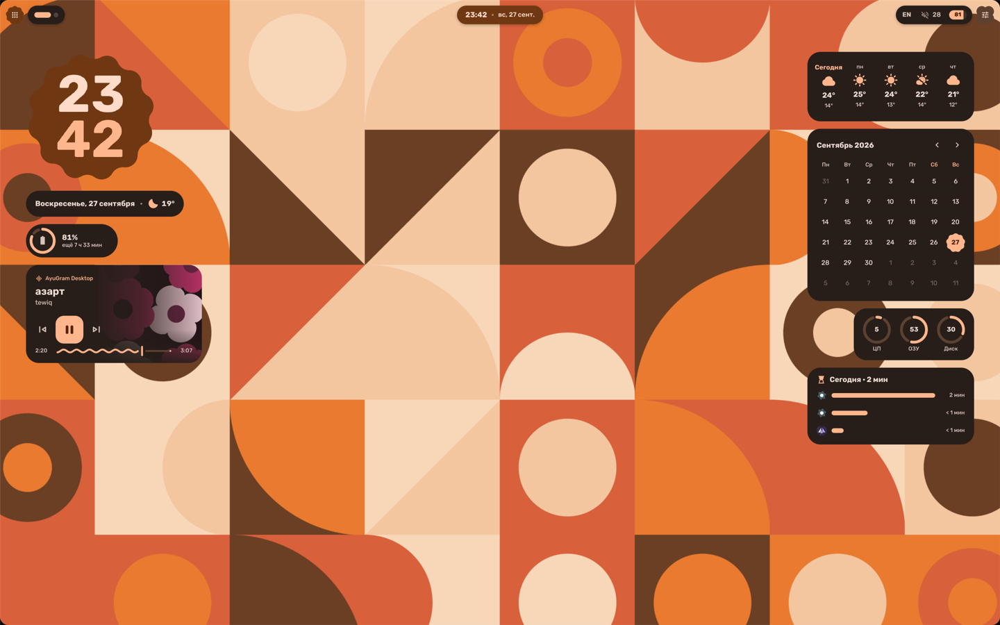
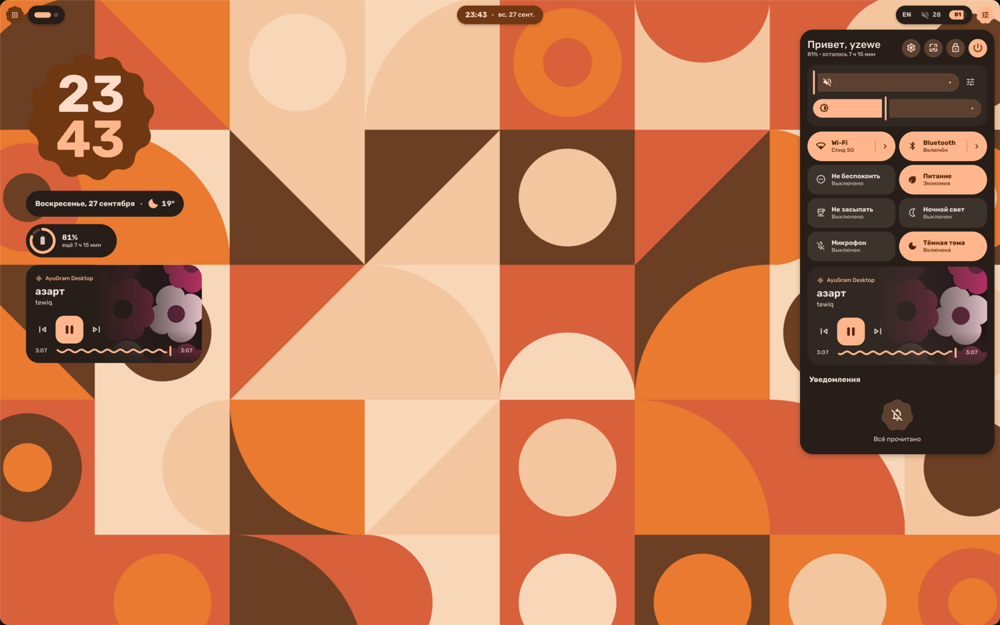
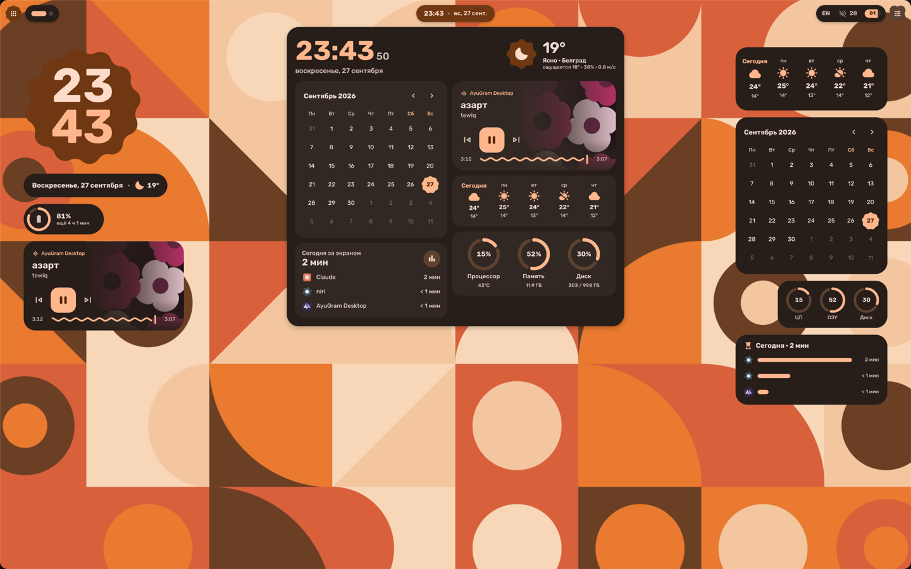
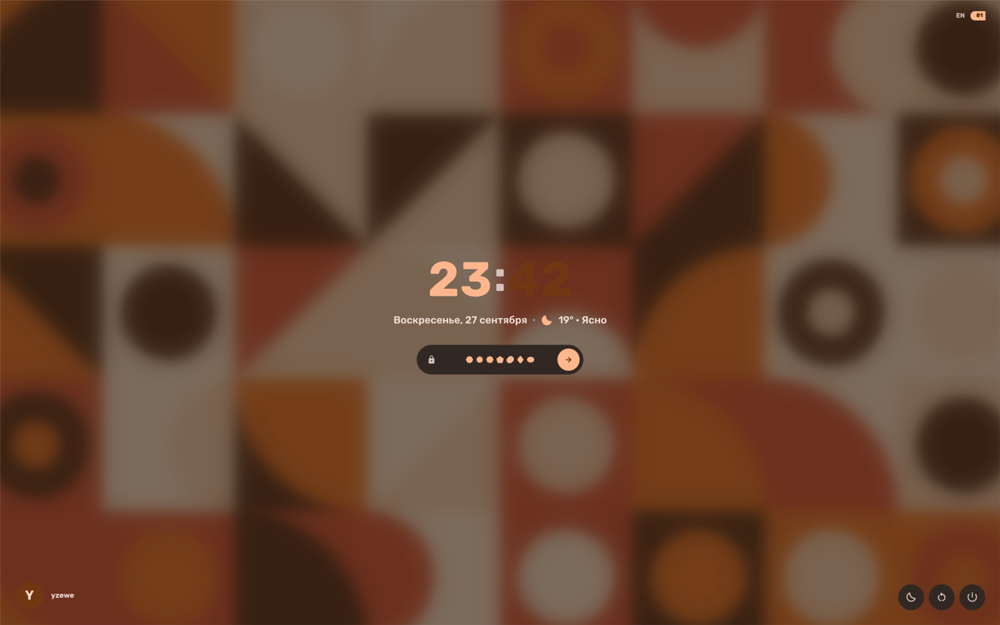
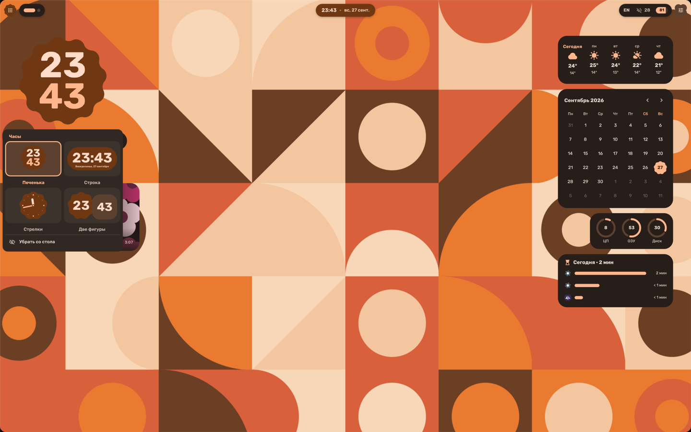
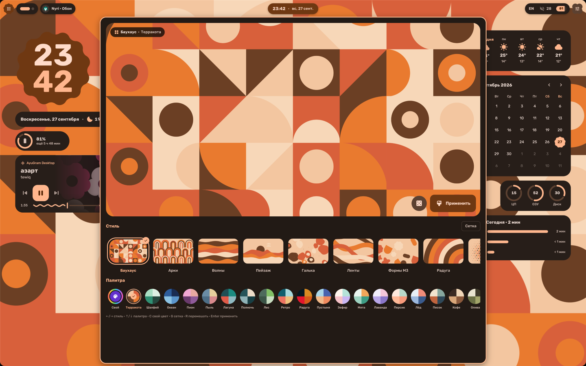
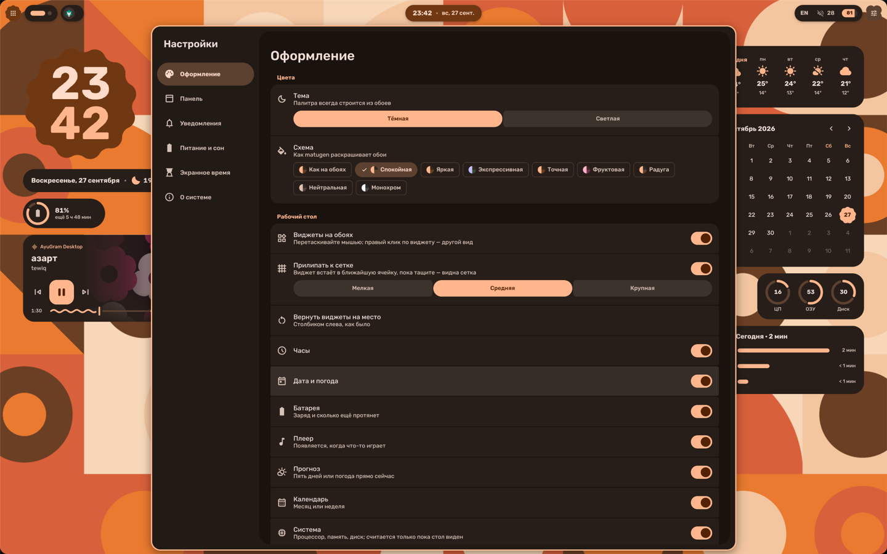

# Nyri

Оболочка для [niri](https://github.com/YaLTeR/niri) на [Quickshell](https://quickshell.org)
в стиле Material 3 Expressive. Панель, шторка, виджеты на рабочем столе, экран
блокировки, окно polkit, настройки и студия обоев написаны с нуля на одном наборе
токенов: цвет, форма, шрифт и пружинная анимация. Палитру из обоев строит matugen,
и ей же перекрашиваются niri, GTK, Qt и терминал.



**[Видео: минута по всем возможностям](docs/demo.mp4)**

| | |
|---|---|
|  |  |
|  |  |
|  |  |

## Что есть

**Панель.** Островки на пружинах, рабочие столы, заголовок окна (по клику меню окна),
часы (по клику дашборд с погодой, календарём, плеером и нагрузкой), трей как в Windows
с переполнением за стрелкой, раскладка и Caps Lock, звук, батарея. Может прятаться
и выезжать сверху, в том числе над полноэкранными окнами.

**Шторка (Mod+N).** Громкость и яркость, плитки быстрых настроек, отдельные страницы
Wi-Fi, Bluetooth и звука (выбор выхода и громкость по приложениям), плеер, уведомления.

**Рабочий стол.** Часы, дата и погода, батарея, плеер, прогноз, календарь, нагрузка
системы, экранное время. Виджеты перетаскиваются мышью и прилипают к сетке. По правому
клику открывается меню с живыми превью всех вариантов виджета: например, у часов есть
«печенька», строка, стрелочные и две фигуры.

**Экран блокировки.** В покое на нём только большие часы, дата и погода. От любой
клавиши часы перетекают в строку и появляется поле пароля; символы — случайные фигуры M3.
При проверке по центру экрана показывается индикатор загрузки M3 Expressive, неверный
пароль трясёт поле. После входа часы улетают, а стол собирается каскадом. Кнопки сна,
перезагрузки и выключения переспрашивают.

**Поиск (Mod+Space).** Приложения, открытые окна и действия шелла в одной выдаче.
Калькулятор и конвертер работают прямо в поиске: `2+2*3`, `100 usd в руб`,
`15% от 2000`, `5 км в милях` (через qalc). `> команда` запускает команду.

**Снимки (Print).** Меню: область, весь экран, рисование поверх, распознавание текста
(eng+rus), поиск через Google Lens, запись экрана без звука и со звуком. Повторное
нажатие Print останавливает запись. Shift+Print сразу пишет выбранную область.

**Студия обоев (Mod+Y).** Генератор плоских векторных обоев: 20 стилей, 33 палитры
и «свой цвет» — выбираешь оттенок, и вся палитра строится из него. Есть сетка-миллиметровка.
Обои можно растянуть одной картинкой на все мониторы.

**Настройки (Mod+I).** Обычное окно в раскладке. Тема и схема цветов (с превью каждой
схемы), ночной свет, скорость анимаций, город для погоды, панель, виджеты, уведомления,
сон и блокировка, экранное время по приложениям.

**Остальное.** Буфер обмена с картинками, OSD громкости и яркости, переключатель окон
Alt+Tab, меню питания, своё окно polkit, пипетка, прицел, скруглённые углы экрана.

Батарея важнее памяти. Поллинга нет: niri, звук, сеть, Bluetooth, батарея и уведомления
приходят событиями. Поверхности существуют, только пока они видны. Таймеры идут, только
пока их результат на экране. В простое шелл берёт около 0,15 % одного ядра.

## Установка

Сделано и проверено на Arch с niri 26.04 и Quickshell 0.3.1.

```bash
sudo pacman -S niri quickshell matugen jq fuzzel cliphist wl-clipboard grim slurp \
    wf-recorder hyprpicker brightnessctl wireplumber playerctl tesseract tesseract-data-rus \
    curl libnotify glib2 kconfig plasma-workspace wlsunset libqalculate resvg swappy \
    python-gobject kitty
```

Шрифты: Rubik, Material Symbols Rounded, JetBrainsMono Nerd Font.

Репозиторий должен лежать в `~/nyri`: на этот путь ссылаются хоткеи.

```bash
git clone https://github.com/yzewe/Nyri ~/nyri
~/nyri/bin/nyri-install
```

Установщик проверяет зависимости, строит тему из обоев и ставит ссылки на `~/.config/niri`,
`~/.config/fuzzel` и `~/.config/quickshell/nyri`. Заменённые файлы он сохраняет
в `~/.config-nyri-backup/<время>/`. После установки нужно выйти из сессии и войти снова.
Откатиться:

```bash
~/nyri/bin/nyri-install --undo
```

Терминал остаётся своим (kitty, fish, starship): Nyri меняет в нём только цвета.

## Клавиши

`Mod` — Super. Внутри тестового окна `Mod` — Alt.

| Клавиши | Что делают |
|---|---|
| Mod+Space | Поиск |
| Mod+N | Шторка |
| Mod+I | Настройки |
| Mod+Y | Студия обоев |
| Mod+V | Буфер обмена |
| Mod+X | Питание и выход |
| Mod+Alt+L | Заблокировать |
| Alt+Tab | Переключатель окон |
| Mod+Tab | Обзор |
| Print | Меню снимка и записи; при записи — остановить |
| Shift+Print | Записать область |
| Mod+Shift+S / X / A | Снимок области / текст с экрана / Google Lens |
| Mod+Shift+R | Запись со звуком |
| Mod+Shift+C | Пипетка |
| Mod+Shift+W | Прятать панель |
| Mod+F / Mod+Ctrl+F / Mod+Shift+F | Развернуть / до краёв / на весь экран |
| Mod+/ | Шпаргалка по клавишам |

## Обои из командной строки

```bash
bin/nyri-wall styles                                  # стили
bin/nyri-wall make bauhaus Терракота 7 out.svg        # просто нарисовать
bin/nyri-wall make garden "#7c4dff/dark" 3 out.svg --grid
bin/nyri-wall apply rings Океан 12                    # поставить и перекрасить всё
```

## Попробовать, не трогая свою сессию

```bash
bin/nyri-nested --own-bus
```

Эта команда запускает niri с Nyri в окне. У тестового окна своя копия настроек
в `$XDG_RUNTIME_DIR/nyri-test`, свой буфер обмена и своя шина D-Bus. В этом окне
не работают сон и выключение, не считается экранное время и не проверяется
настоящий пароль. Видео выше записано сценарием `tools/demo.sh` в таком окне.

## Где что лежит

```
bin/            nyri (диспетчер хоткеев), nyri-install, nyri-link, nyri-nested,
                nyri-theme, nyri-wall, nyri-kde-colors, nyri-term-colors, nyri-capswatch
config/niri/    ввод, раскладка, анимации и шейдеры окон, правила, автозапуск, хоткеи
config/quickshell/nyri/
  theme/        Colors, Motion, Shape, Type — токены M3E
  services/     niri, звук, сеть, bluetooth, батарея, погода, уведомления, настройки…
  widgets/      базовые компоненты: текст, иконки, пружины, фигуры, переключатели…
  bar/ control/ lock/ launcher/ wallpaper/ settings/ popouts/ polkit/ snip/ …
matugen/        шаблоны для niri, fuzzel и GTK
tools/          подбор пружин, демо-плеер, сценарий видео
```

Состояние не хранится в git, оно лежит в `~/.local/state/nyri/`: настройки, тема,
экранное время. Сгенерированные обои — в `~/.local/share/nyri/walls/`.

## Лицензия

MIT, см. `LICENSE`. Библиотека фигур в `config/quickshell/nyri/lib/shapes` — Apache-2.0.
